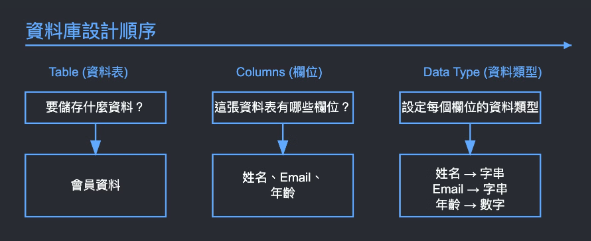
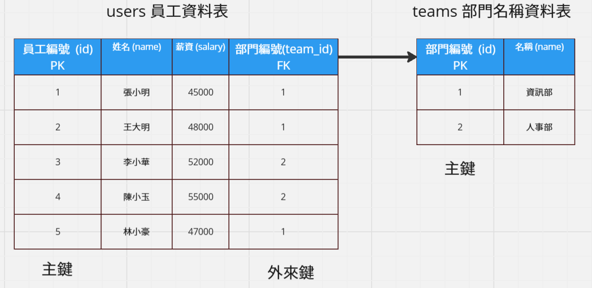

# PostgreSQL 資料庫學習紀錄

主要根據六角學院 「2024 後端工程師 - 資料庫體驗營」整理的學習筆記，方便查閱。

- [課程簡報](https://gamma.app/docs/SQL--23heyix4r93u5u0?mode=doc#card-zbtn6kfn3th4gpr)

- [每日任務紀錄](./task/task.md)

## 目錄

- 資料庫簡介

  - [資料庫的形式](#資料庫的形式)

  - [如何操作資料庫？](#如何操作資料庫)

  - [資料庫設計順序](#資料庫設計順序)

  - [Data Type 資料類型](#data-type-資料類型)

  - [新增一張資料表](#新增一張資料表)

  - [新增資料 ( insert )](#新增資料-insert)

  - [SELECT 查詢](#select-查詢)

    - [AS 新增別名](#as-新增別名)

  - [WHERE 篩選資料](#where-篩選資料)

    - [比較運算子](#比較運算子)

    - [邏輯運算子](#邏輯運算子)

    - [集合與範圍運算子](#集合與範圍運算子)

  - [更新資料](#更新資料)

  - [刪除資料](#刪除資料)

  - [小節作業：家具店的菜雞銷售奇遇記](#小節作業家具店的菜雞銷售奇遇記)

- [Tables 資料表管理](#tables-資料表管理)

  - [從單張資料表升級到多張資料表的管理流程](#從單張資料表升級到多張資料表的管理流程)

  - [主鍵和外來鍵的差異](#主鍵和外來鍵的差異)

  - [如何規劃外來鍵與資料表拆分](#如何規劃外來鍵與資料表拆分)

  - [主鍵設定方式、ID 自動遞增方法](#主鍵設定方式id-自動遞增方法)

  - [建立完整資料庫流程](#建立完整資料庫流程)

  - [合併資料表查詢](#合併資料表查詢)

  - [主鍵、外來鍵 constraint 約束提醒](#主鍵外來鍵-constraint-約束提醒)

  - [小節作業：主鍵、外來鍵、INNER JOIN](#小節作業主鍵外來鍵inner-join)

- [資料庫與 Docker 環境建立](#資料庫與-docker-環境建立)

  - [安裝 DBeaver](#安裝-dbeaver)

  - [安裝 Docker Desktop](#安裝-docker-desktop)

## 資料庫的形式

- 資料表 ( Table )

  整體資料，包含了所有相關的資料。

- 欄位 ( Columns )

  定義資料的屬性和類型 ( Data Type )。

- 資料列 ( Rows )

  橫向的資料集合，代表一筆完整資料。

## 如何操作資料庫？

可以透過 **SQL** 指令操作資料庫，全名是 "Structured Query Language"，中文是「結構化查詢語言」。

練習平台：[Temporary Postgres Database](https://pg-sql.com/)

## 資料庫設計順序



## Data Type 資料類型

| 資料型態     | 描述         | 使用情境       | 範例                  | 範例欄位               |
| :----------- | :----------- | :------------- | :-------------------- | :--------------------- |
| INTEGER      | 整數         | ID、年齡、數量 | 1, 42, -15            | `age INTEGER`          |
| VARCHAR(n)   | 可變長度字串 | 名稱、描述     | "John Doe"            | `name VARCHAR(50)`     |
| TIMESTAMP    | 日期時間     | 建立/更新時間  | '2024-03-20 15:30:00' | `created_at TIMESTAMP` |
| DECIMAL(p,s) | 精確小數     | 金額計算       | 199.99                | `price DECIMAL(10,2)`  |
| BOOLEAN      | 真/假值      | 狀態、開關     | true, false           | `is_active BOOLEAN`    |
| JSON         | JSON 資料    | 彈性資料結構   | '{"name": "John"}'    | `settings JSON`        |

## 新增一張資料表

使用 `CREATE TABLE` 來指定 `資料表名稱`及定義 `資料的屬性和類型`。

> 記得結尾加上 `;` 來結束整個 SQL 指令。

```sql
CREATE TABLE users (
  name VARCHAR(50),
  email VARCHAR(100),
  age INTEGER
);
```

## 新增資料 (insert)

使用 `INSERT INTO` 來指定要新增資料的 `資料表名稱`及 `資料欄位`，`VALUES` 後面 使用 `()` 來添加對應欄位的一筆資料。

```sql
INSERT INTO users (name, email, age)
VALUES ('張小明', 'kdjkl@gmail.com', 25);
```

若要一次新增多筆資料則使用 `,` 分隔多筆 `()` 資料即可。

```sql
INSERT INTO users (name, email, age)
VALUES
  ('張小美', 'k2djkl@gmail.com', 21),
  ('張小立', 'kdj3kl@gmail.com', 34),
  ('張小花', 'kdjk4l@gmail.com', 28);
```

## SELECT 查詢

使用 `SELECT` 可以查詢指定資料表 ( `FROM` 後指定資料表名稱 ) 的特定欄位的所有資料。

```sql
-- 查詢所有欄位
SELECT * FROM users;
```


```sql
-- 查詢特定欄位 (只要 name 和 age)
SELECT name, age FROM users;
```


### AS 新增別名

可以使用 `AS` 設定查詢資料的**欄位別名**，並且也可設定查詢計算的資料欄位名稱。

```sql
SELECT
  name AS 姓名,
  age AS 現在年齡,
  65 - age AS 距離退休年數
FROM users;
```


## WHERE 篩選資料

使用 `WHERE` 可以篩選指定的資料。

### 練習用資料庫環境

```sql
-- 商品資料表
CREATE TABLE products (
    name VARCHAR(100),           -- 商品名稱
    price INTEGER,              -- 原價
    discount_price INTEGER,      -- 折扣價
    stock INTEGER,              -- 庫存數量
    category VARCHAR(50),        -- 商品類別
    status VARCHAR(20)          -- 商品狀態（上架、下架）
);

INSERT INTO products (name, price, discount_price, stock, category, status) VALUES
   ('iPhone 16', 25000, 23000, 50, '3C', 'active'),
   ('AirPods', 5000, 5000, 5, '3C', 'inactive'),
   ('iPad', 18000, 16000, 25, '3C', 'active'),
   ('充電線', 500, 500, 100, '配件', 'active'),
   ('手機殼', 300, 250, 30, '配件', 'active'),
   ('螢幕保護貼', 200, 180, 150, '配件', 'active'),
   ('手機支架', 400, 400, 0, '配件', 'inactive');
```


#### 查找 3C 類別的產品：

```sql
SELECT name, price
FROM products
WHERE category = '3C';
```


### 比較運算子

| 運算子 | 意義     | 範例                 |
| :----- | :------- | :------------------- |
| =      | 等於     | `WHERE price = 100`  |
| >      | 大於     | `WHERE price > 100`  |
| <      | 小於     | `WHERE price < 100`  |
| >=     | 大於等於 | `WHERE price >= 100` |
| <=>    | 小於等於 | `WHERE price <= 100` |

#### 查找庫存小於 50 的產品：

```sql
SELECT name, stock
FROM products
WHERE stock < 50;
```


### 邏輯運算子

| 運算子 | 意義                 | 範例                                         |
| :----- | :------------------- | :------------------------------------------- |
| AND    | 且，兩個條件都要成立 | `WHERE category = '3C' AND price > 1000`     |
| OR     | 或，其中一個條件成立 | `WHERE category = '3C' OR category = '配件'` |

#### 已上架的 3C 商品：

```sql
SELECT name, price, stock
FROM products
WHERE status = 'active'
AND category = '3C';
```


#### 下架或無庫存商品：

```sql
SELECT name, status, stock
FROM products
WHERE status = 'inactive'
  OR stock = 0;
```


### 集合與範圍運算子

| 運算子  | 意義               | 範例                               |
| :------ | :----------------- | :--------------------------------- |
| BETWEEN | 在指定的範圍內     | `WHERE price BETWEEN 100 AND 500`  |
| IN      | 包含在列出的值中   | `WHERE category IN ('3C', '配件')` |
| NOT IN  | 不包含在列出的值中 | `WHERE category NOT IN ('3C')`     |

#### 想幫家人買生日禮物，預算在 500~1000 元：

```sql
SELECT * FROM products
WHERE discount_price BETWEEN 500 AND 1000;
```


#### 找出特定類別商品：

```sql
SELECT * FROM products
WHERE category IN ('3C');
```


#### 排除特定商品 (充電線、手機殼、螢幕保護貼)：

```sql
SELECT * FROM products
WHERE name NOT IN ('充電線', '手機殼', '螢幕保護貼');
```


## 更新資料


#### 調整特定商品的價格：

```sql
UPDATE products
SET price = 28000
WHERE name = 'iPhone 16';
```

#### 更新庫存數量：

```sql
UPDATE products
SET stock = stock + 50
WHERE name = '手機殼';
```

#### 同時修改多個欄位：

```sql
UPDATE products
SET stock = stock + 50, name = '充電線-修正'
WHERE name = '充電線';
```

## 刪除資料


#### 單筆刪除 - 刪除特定商品：

```sql
DELETE FROM products
WHERE name = 'iPhone 16';
```

#### 條件刪除 - 刪除類別為 3C 的商品：

```sql
DELETE FROM products
WHERE category = '3C';
```

#### 多重條件刪除 - 刪除沒庫存且已下架的商品 ：

```sql
DELETE FROM products
WHERE stock = 0 AND status = 'inactive';
```

## 小節作業：家具店的菜雞銷售奇遇記

[小節作業](./homework/work1/homework_1.md)

## Tables 資料表管理

[miro 簡報](https://miro.com/app/board/uXjVLMcM_hQ=/)

### 從單張資料表升級到多張資料表的管理流程


當我們只有單張資料表時，想要修改部門名稱的開發部為資訊部時，就會**需要花較多的時間去針對所有開發部的員工資料去進行寫入修改**，對資料庫的效能來說較差。

實務上則是會拆分成多張資料表來進行管理，如下圖：


多了一個部門編號 (team_id) 的欄位，並且其會對應到新的部門名稱資料表 (teams) 中的部門編號 (id) 的欄位。

這時候如果想要修改開發部為資訊部時，就只需要對部門名稱資料表 (teams) 進行寫入修改即可。

### 主鍵和外來鍵的差異

當拆分成多張資料表進行管理時，會將資料表的指定欄位設定為主鍵和外來鍵來進行多張資料表之間的關聯。


- 主鍵 ( Primary Key，簡稱 PK )

  - 1.每個資料表都要有**一個主鍵** (只能有一個)。

  - 2.主鍵的值必須是**唯一的**，**不能重複**。

  - 3.主鍵不能是 `Null` 值，但外來鍵可以是 `Null` 值。

  - 4.大部分情況會命名為 `'id'`，使用整數或 UUID 。

  - 5.設定後就不應該再更動。

- 外來鍵 ( Foreign Key，簡稱 FK )

  - 1.當資料**需要關聯到其他表格**時才會用到。

  - 2.同一個資料表中，可以有多個外來鍵。

  - 3.命名通常會用 `'參考資料表_id'` 的格式。

  - 4.外來鍵必須**對應到被參考資料表的主鍵**。

剛剛的範例中就是將員工資料表 (users) 的員工編號 (id) 設為主鍵 (PK)，而外來鍵 (FK) 部門編號 (team_id) 則是會對應到部門名稱資料表 (teams) 中的主鍵 (PK) 部門編號 (id)。

### 如何規劃外來鍵與資料表拆分


### 主鍵設定方式、ID 自動遞增方法

可以在新增資料表時，使用 `PRIMARY KEY` 設定主鍵，使用 `SERIAL` 則是可以設定欄位為 ID 自動遞增。

```sql
CREATE TABLE users (
  id SERIAL PRIMARY KEY, -- 員工編號，主鍵
  name VARCHAR(50) -- 員工姓名
);
```

現在新增資料只需要設定員工姓名 ( name ) 欄位，員工編號 ( id ) 則會自己遞增。

```sql
INSERT INTO users (name)
VALUES
  ('張小美'),
  ('張小立'),
  ('張小花');
```


### 建立完整資料庫流程

根據以下結構建立完整的資料表。



- 建立 teams 資料表

  ```sql
  CREATE TABLE teams (
    id SERIAL PRIMARY KEY, -- 部門編號，主鍵
    name VARCHAR(50)  -- 部門名稱
  );
  ```

- 建立 users 資料表

  使用 `FOREIGN KEY` (未來鍵欄位) `REFERENCES` 資料表 (主鍵欄位) 語法來設定外來鍵並關聯資料表主鍵。

  ```sql
  CREATE TABLE users (
    id SERIAL PRIMARY KEY, -- 員工編號，主鍵
    name VARCHAR(50), -- 姓名
    salary INTEGER, -- 薪資
    team_id INTEGER,  -- 部門編號，外來鍵
    FOREIGN KEY (team_id) REFERENCES teams (id) -- 設定外來鍵關聯
  );
  ```

- 新增部門 ( teams ) 資料

  ```sql
  INSERT INTO teams (name)
  VALUES
    ('開發部'),
    ('人事部');
  ```

  

- 新增員工 ( users ) 資料

  ```sql
  INSERT INTO users (name, salary, team_id)
  VALUES
    ('張小明', 45000, 1),
    ('王大明', 48000, 1),
    ('李小華', 52000, 2),
    ('陳小玉', 55000, 2),
    ('林小豪', 47000, 1);
  ```

  

### 合併資料表查詢

- 搭配 `WHERE` 條件。

  同時查詢兩張表的指定欄位，並搭配 `WHERE` 根據部門 id 查詢符合的資料。

  > `users.name` 和 `teams.name` 欄位名稱相同，可能導致錯誤，因此可以使用 `AS` 指定欄位別名。

  ```sql
  SELECT
    users.id,
    users.name,
    users.salary,
    teams.name AS 部門名稱
  FROM users,teams
  WHERE users.team_id = teams.id;
  ```

  

- 使用 `INNER JOIN`。

  實際結果與 `WHERE` 相同，主流建議使用這種方式。

  `INNER JOIN` 要合併的資料表 `ON` 條件。

  > `FROM` 後面只需要主要查詢的資料表。

  ```sql
  SELECT
    users.id,
    users.name,
    users.salary,
    teams.name AS 部門名稱
  FROM users
  INNER JOIN teams ON users.team_id = teams.id;
  ```

  

### 主鍵、外來鍵 constraint 約束提醒

- 當新增資料時主鍵重複，會出現錯誤提示。

  ```sql
  INSERT INTO users (id, name, salary, team_id)
  VALUES (4, '李小花', 48000, 2);
  ```

  

- 當新增資料時外來鍵不存在對應資料，會出現錯誤提示。

  ```sql
  INSERT INTO users (name, salary, team_id)
  VALUES ('李小花', 48000, 3);
  ```

  

### 小節作業：主鍵、外來鍵、INNER JOIN

[小節作業](./homework/work2/homework_2.md)

## 資料庫與 Docker 環境建立

以下皆使用 Windows 環境。

### 安裝 DBeaver

[DBeaver](https://dbeaver.io/) 是一個 SQL 客戶端和資料庫管理工具。

安裝 Windows 版本：


安裝完成：


### 安裝 Docker Desktop

[Docker](https://www.docker.com/) 是一種軟體平台，可讓你快速地建置、測試和部署應用程式。

Docker 將軟體封裝到名為**容器**的標準化單位，其中包含程式庫、系統工具、程式碼和執行時間等執行軟體所需的所有項目。


安裝 Windows 版本：

> [Windows 排錯教學](https://chalk-freedom-ec6.notion.site/Windows-89848c476c6b44928bd9ead5046fa06b)


安裝完成：


