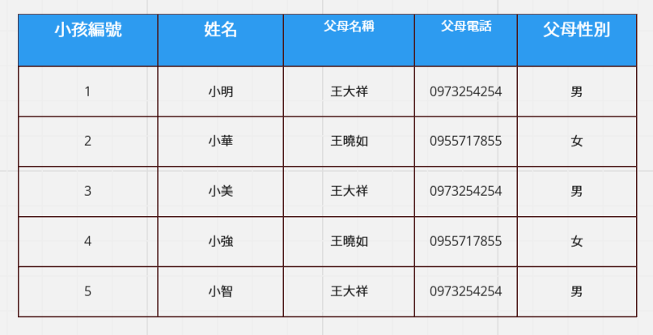

# 小節作業：主鍵、外來鍵、INNER JOIN

練習平台：[Temporary Postgres Database](https://pg-sql.com/)

## 目錄

- [作業一：拯救明華國小的資料庫，哪個欄位適合變成外來鍵？](#作業一拯救明華國小的資料庫哪個欄位適合變成外來鍵)

- [作業二：作業一的延伸，多了一個班級老師](#作業二作業一的延伸多了一個班級老師)

- [作業三：小孩的家庭歸類資料庫，父母資料一直重複實在討厭！](#作業三小孩的家庭歸類資料庫父母資料一直重複實在討厭)

## 作業一：拯救明華國小的資料庫，哪個欄位適合變成外來鍵？


口訣：「多的要設定成外來鍵」。

- 一個學生只有一個班級

- 一個班級會有多個學生

因此「**班級**」欄位適合設定成外來鍵。

- 建立資料庫

  ```sql
  -- 建立班級資料表
  CREATE TABLE classes (
      id SERIAL PRIMARY KEY,  -- 班級編號，主鍵
      name VARCHAR(50)        -- 班級名稱
  );

  -- 建立學生資料表
  CREATE TABLE students (
      id SERIAL PRIMARY KEY,  -- 學生編號，主鍵
      name VARCHAR(50),       -- 姓名
      gender VARCHAR(10),     -- 性別
      age INTEGER,            -- 年齡
      class_id INTEGER,       -- 班級編號，外來鍵
      FOREIGN KEY (class_id) REFERENCES classes(id)  -- 設定外來鍵關聯
  );

  -- 新增班級資料
  INSERT INTO classes (name)
  VALUES
    ('三年一班'),
    ('三年二班');

  -- 新增學生資料
  INSERT INTO students (name, gender, age, class_id)
  VALUES
    ('小明', '男', 8, 1),
    ('小華', '女', 9, 2),
    ('小美', '男', 8, 1),
    ('小強', '女', 8, 1),
    ('小智', '男', 9, 2);
  ```

- 班級資料表查詢

  ```sql
  SELECT * FROM classes;
  ```

  

- 學生資料表查詢

  ```sql
  SELECT * FROM students;
  ```

  

- 合併資料表查詢

  ```sql
  SELECT
    students.id AS 學生編號,
    students.name AS 姓名,
    classes.name AS 班級,
    students.gender AS 性別,
    students.age AS 年齡
  FROM students
  INNER JOIN classes ON students.class_id = classes.id;
  ```

  

## 作業二：作業一的延伸，多了一個班級老師


口訣：「多的要設定成外來鍵」。

- 一個學生只有一個班級老師

- 一個班級老師會有多個學生

因此「**班級老師**」欄位適合設定成外來鍵。

- 修改資料庫

  ```sql
  -- 建立班級老師資料表
  CREATE TABLE teachers (
      id SERIAL PRIMARY KEY,  -- 班級老師編號，主鍵
      name VARCHAR(50)       -- 名稱
  );

  -- 新增班級老師資料
  INSERT INTO teachers (name)
  VALUES
    ('廖洧杰'),
    ('卡斯柏'),
    ('查理'),
    ('麥可'),
    ('李燕容');

  -- 班級老師資料表查詢
  SELECT * FROM teachers;
  ```

  

  ```sql
  -- 修改學生資料表欄位
  ALTER TABLE students
  ADD COLUMN teacher_id INTEGER, -- 班級老師編號，外來鍵
  ADD CONSTRAINT fk_teacher_id FOREIGN KEY (teacher_id) REFERENCES teachers(id); -- 設定外來鍵關聯

  -- 更新學生資料
  UPDATE students SET teacher_id = 1 WHERE id = 1;
  UPDATE students SET teacher_id = 2 WHERE id = 2;
  UPDATE students SET teacher_id = 3 WHERE id = 3;
  UPDATE students SET teacher_id = 4 WHERE id = 4;
  UPDATE students SET teacher_id = 5 WHERE id = 5;

  -- 學生資料表查詢
  SELECT * FROM students;
  ```

  

- 合併資料表查詢

  ```sql
  SELECT
    students.id AS 學生編號,
    students.name AS 姓名,
    classes.name AS 班級,
    teachers.name AS 班級老師,
    students.gender AS 性別,
    students.age AS 年齡
  FROM students
  INNER JOIN classes ON students.class_id = classes.id
  INNER JOIN teachers ON students.teacher_id = teachers.id;
  ```

  

## 作業三：小孩的家庭歸類資料庫，父母資料一直重複實在討厭！



口訣：「多的要設定成外來鍵」。

- 一個小孩只有一個緊急聯絡人

- 一個緊急聯絡人會有多個小孩

因此「**父母名稱**」欄位適合設定成外來鍵。

- 修改資料庫

  ```sql
  -- 建立家長資料表
  CREATE TABLE parents (
      id SERIAL PRIMARY KEY,  -- 家長編號，主鍵
      name VARCHAR(50),       -- 家長名稱
      phone VARCHAR(20),      -- 家長電話
      gender VARCHAR(10)      -- 家長性別
  );

  -- 新增家長資料
  INSERT INTO parents (name, phone, gender)
  VALUES
    ('王大祥', '0973254254', '男'),
    ('王曉如', '0955717855', '女');

  -- 家長資料表查詢
  SELECT * FROM parents;
  ```

  

  ```sql
  -- 修改學生資料表欄位
  ALTER TABLE students
  ADD COLUMN parent_id INTEGER, -- 家長編號，外來鍵
  ADD CONSTRAINT fk_parent_id FOREIGN KEY (parent_id) REFERENCES parents(id); -- 設定外來鍵關聯

  -- 更新學生資料
  UPDATE students SET parent_id = 1 WHERE id IN (1, 3, 5);
  UPDATE students SET parent_id = 2 WHERE id IN (2, 4);

  -- 學生資料表查詢
  SELECT * FROM students
  ORDER BY id ASC;
  ```

  

- 合併資料表查詢

  ```sql
  SELECT
    students.id AS 小孩編號,
    students.name AS 姓名,
    parents.name AS 父母名稱,
    parents.phone AS 父母電話,
    parents.gender AS 父母性別
  FROM students
  INNER JOIN parents ON students.parent_id = parents.id
  ORDER BY students.id ASC;
  ```

  
