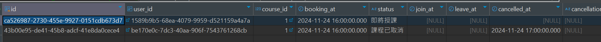
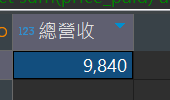

# 任務二：健身教練線上直播課平台

六角學院 「2024 後端工程師 - 資料庫體驗營」的最終任務。

## 目錄

- [任務二情境](#任務二情境)

- [任務二資訊](#任務二資訊)

- [開始答題前，請先了解以下內容](#開始答題前請先了解以下內容)

- [答題方式說明](#答題方式說明)

  - [一、練習方式一：使用 pg-sql 網站練習](#一練習方式一使用-pg-sql-網站練習)

  - [二、練習方式二：使用 DBeaver 連結 Docker，並在 DBeaver 進行練習](#二練習方式二使用-dbeaver-連結-docker並在-dbeaver-進行練習)

- [題目](#題目)

  - [資料表結構](#資料表結構)

  - [1. 用戶資料，資料表為 `USER`](#1-用戶資料資料表為-user)

  - [2. 組合包方案 `CREDIT_PACKAGE`、客戶購買課程堂數 `CREDIT_PURCHASE`](#2-組合包方案-credit_package客戶購買課程堂數-credit_purchase)

  - [3. 教練資料 ，資料表為 `COACH` , `SKILL` , `COACH_LINK_SKILL`](#3-教練資料-資料表為-coach--skill--coach_link_skill)

  - [4. 課程管理 `COURSE`](#4-課程管理-course)

  - [5. 客戶預約與授課 `COURSE_BOOKING`](#5-客戶預約與授課-course_booking)

  - [6. 後台報表](#6-後台報表)

## 任務二情境

有一間廠商即將建置「健身教練線上直播課平台」

其優點是：

- **小班制健身直播課制**：教練會在平台開課，學生前往教練開設的課程頁面報名，課程時間到了後，就可點擊課程直播室進行上課

- 堂數售價：每位健身教練的收費都一致，一堂 50 分鐘**小班制健身直播課**都是 200 元

堂數組合包方案：

- 7 堂組合包方案：

  - 價格：1,400 元

- 14 堂方案：

  - 價格：2,520 元

- 21 堂方案：

  - 價格：4,800 元

## 任務二資訊

- [wireframe 線稿圖](https://miro.com/app/board/uXjVLbiDml0=/?share_link_id=404709829822)

- [建立 Table 資料表指令](https://hackmd.io/@hexschool/SkpaT_jfye)

- [資料表全覽](https://images.hexschool.com/common/MTc1Mzc2NDQzNDQ4MzQ1MjMxMzc=_2024-11-26T15:23:35Z.png)

## 開始答題前，請先了解以下內容

為了提高任務的體驗，我們在資料表和欄位的設計上有些調整，所以這份任務的資料表內容並**不適合直接用於實務喔**！

### 下面將為各位說明調整的內容：

- **1.使用者的資料表通常會有密碼欄位**

  這個任務並沒有伺服器來做密碼驗證，因此此資料表設計將密碼欄位先移除，直接由 email 來取得使用者 id。

- **2.權限設計除了角色 (Role) 以外，還會包含可用的細部權限功能**

  為了讓同學可以快速體驗角色區分，這個任務的角色權限設計只有簡單的角色 Role 欄位。

  實務上除了角色 (Role) 以外，還會包含可用的細部權限功能以及可操作的行爲。

- **3.統計資料通常會透過排程功能統計後，記錄到另一張表**

  在部分基於統計與計算行為的題目中，你會發現都是即時運算。

  而在實務上，這些不變的統計資料，他們通常會被獨立在另外一張資料表，並由一個排程功能來統計後，記錄至資料表。

- **4.不會直接刪除資料庫的資料，而使用軟刪除**

  基於 DELETE 語法練習，題目中有直接刪除資料庫資料的操作。

  實務上通常我們不會直接刪除資料庫的資料，而是使用欄位或資料表來實作刪除標記，避免意外刪除導致無法挽回的結果，這種刪除被稱為軟刪除，而直接將資料完全刪除的行為，則稱為硬刪除。

- **5.資料表與欄位需搭配伺服器的商業邏輯，有更複雜的設計**

  在關於課程相關（包括購買，預約等行為），是特別被大幅度的簡化的資料表。

  在實務上他需要更多的資料表與欄位，並且搭配伺服器的商業邏輯，來確保使用者每一步驟的狀態變化都被留下紀錄。

- **6. 資料庫紀錄的時間會以 UTC 為準**

  這次任務在時間的欄位上，大部分的時間都已經設定好自動產生。

  在實務上，資料庫紀錄的時間大多也是使用 UTC 時間。

## 答題方式說明

請先將 [此專案模板](https://github.com/hexschool/backend-database-camping-task-startkit) fork 到自己的 GitHub 帳號下。

可以使用以下兩種方式之一，完成 SQL 指令後，請將答案貼至專案中的 `/migrations/task/sqls/20241021064214-task-up.sql`，並 push 到自己的 GitHub Repo 繳交任務。

### 一、練習方式一：使用 pg-sql 網站練習

- 網站網址：https://pg-sql.com/

- [資料表建立指令](https://hackmd.io/fsxK8JJXRtaMml_e3bD2Xg)

### 二、練習方式二：使用 DBeaver 連結 Docker，並在 DBeaver 進行練習

> ⚠️ 專案模板已經完成 **建立資料表**，同學不需要再次建立。

可以參照「[操作流程](https://gonsakon.notion.site/1461c492e9b580ceb647d89505b95c6a)」說明來練習 SQL 指令。

可以將模板 `/migrations/task/sqls/20241021064214-task-up.sql` 中的題目註解貼到 DBeaver，方便對照題目練習。


## 題目

### 資料表結構


---

### 1. 用戶資料，資料表為 `USER`

#### 1-1 新增：新增六筆用戶資料

資料如下：

- 用戶名稱為 `李燕容`，Email 為 `lee2000@hexschooltest.io`，Role 為 `USER`

- 用戶名稱為 `王小明`，Email 為 `wXlTq@hexschooltest.io`，Role 為 `USER`

- 用戶名稱為 `肌肉棒子`，Email 為 `muscle@hexschooltest.io`，Role 為 `USER`

- 用戶名稱為 `好野人`，Email 為 `richman@hexschooltest.io`，Role 為 `USER`

- 用戶名稱為 `Q太郎`，Email 為 `starplatinum@hexschooltest.io`，Role 為 `USER`

- 用戶名稱為 `透明人`，Email 為 `opcatiy0@hexschooltest.io`，Role 為 `USER`

```sql
insert into "USER" (name, email, role)
values
	('李燕容', 'lee2000@hexschooltest.io', 'USER'),
	('王小明', 'wXlTq@hexschooltest.io', 'USER'),
	('肌肉棒子', 'muscle@hexschooltest.io', 'USER'),
	('好野人', 'richman@hexschooltest.io', 'USER'),
	('Q太郎', 'starplatinum@hexschooltest.io', 'USER'),
	('透明人', 'opacity0@hexschooltest.io', 'USER');
```


#### 1-2 修改：用 Email 找到 `李燕容`、`肌肉棒子`、`Q太郎`，如果他的 Role 為 `USER` 將他的 Role 改為 `COACH`

```sql
update "USER"
set "role" = 'COACH'
where email in ('lee2000@hexschooltest.io', 'muscle@hexschooltest.io', 'starplatinum@hexschooltest.io')
and "role" = 'USER';
```


#### 1-3 刪除：刪除 `USER` 資料表中，用 Email 找到 `透明人`，並刪除該筆資料

```sql
delete from "USER"
where email = 'opacity0@hexschooltest.io';
```


#### 1-4 查詢：取得 `USER` 資料表目前所有用戶數量

> 提示：使用 `COUNT` 函式

```sql
select count(*) as 用戶數量 from "USER";
```


#### 1-5 查詢：取得 `USER` 資料表所有用戶資料，並列出前 3 筆

> 提示：使用 `LIMIT` 語法

```sql
select * from "USER"
limit 3;
```


---

### 2. 組合包方案 `CREDIT_PACKAGE`、客戶購買課程堂數 `CREDIT_PURCHASE`

#### 2-1 新增：在 `CREDIT_PACKAGE` 資料表新增三筆教練資料

資料需求如下：

- 名稱為 `7 堂組合包方案`，價格為 `1,400` 元，堂數為 `7`

- 名稱為 `14 堂組合包方案`，價格為 `2,520` 元，堂數為 `14`

- 名稱為 `21 堂組合包方案`，價格為 `4,800` 元，堂數為 `21`

```sql
insert into "CREDIT_PACKAGE" ("name" , price, credit_amount)
values
	('7 堂組合包方案', 1400, 7),
	('14 堂組合包方案', 2520, 14),
	('21 堂組合包方案', 4800, 21);
```


#### 2-2 新增：在 `CREDIT_PURCHASE` 資料表，新增三筆資料

> （請使用 name 欄位做子查詢）

資料如下：

- `王小明` 購買 `14 堂組合包方案`

- `王小明` 購買 `21 堂組合包方案`

- `好野人` 購買 `14 堂組合包方案`

```sql
insert into "CREDIT_PURCHASE" (user_id, credit_package_id, purchased_credits, price_paid)
values
	(
		(select id from "USER" where email = 'wXlTq@hexschooltest.io'),
		(select id from "CREDIT_PACKAGE" where name = '14 堂組合包方案'),
		(select credit_amount from "CREDIT_PACKAGE" where name = '14 堂組合包方案'),
		(select price from "CREDIT_PACKAGE" where name = '14 堂組合包方案')
	),
	(
		(select id from "USER" where email = 'wXlTq@hexschooltest.io'),
		(select id from "CREDIT_PACKAGE" where name = '21 堂組合包方案'),
		(select credit_amount from "CREDIT_PACKAGE" where name = '21 堂組合包方案'),
		(select price from "CREDIT_PACKAGE" where name = '21 堂組合包方案')
	),
	(
		(select id from "USER" where email = 'richman@hexschooltest.io'),
		(select id from "CREDIT_PACKAGE" where name = '14 堂組合包方案'),
		(select credit_amount from "CREDIT_PACKAGE" where name = '14 堂組合包方案'),
		(select price from "CREDIT_PACKAGE" where name = '14 堂組合包方案')
	);
```


---

### 3. 教練資料 ，資料表為 `COACH` , `SKILL` , `COACH_LINK_SKILL`

#### 3-1 新增：在 `COACH` 資料表新增三筆教練資料

> 提示：使用 `李燕容` 的 email ，取得 `李燕容` 的 `id`

資料需求如下：

- 將用戶 `李燕容` 新增為教練，並且年資設定為 `2` 年

- 將用戶 `肌肉棒子`新增為教練，並且年資設定為 `2` 年

- 將用戶 `Q太郎` 新增為教練，並且年資設定為 `2` 年

```sql
insert into "COACH" (user_id, experience_years)
values
	((select id from "USER" where email = 'lee2000@hexschooltest.io'), 2),
	((select id from "USER" where email = 'muscle@hexschooltest.io'), 2),
	((select id from "USER" where email = 'starplatinum@hexschooltest.io'), 2);
```


#### 3-2 新增：承 1，為三名教練新增專長資料至連結表 `COACH_LINK_SKILL`

資料需求如下：

- 所有教練都有 `重訓` 專長

- 教練 `肌肉棒子` 需要有 `瑜伽` 專長

- 教練 `Q太郎` 需要有 `有氧運動` 與 `復健訓練` 專長

```sql
insert into "COACH_LINK_SKILL" (coach_id , skill_id)
values
	(
		(select id from "COACH" where user_id = (select id from "USER" where email = 'lee2000@hexschooltest.io')),
		(select id from "SKILL" where name = '重訓')
	),
	(
		(select id from "COACH" where user_id = (select id from "USER" where email = 'muscle@hexschooltest.io')),
		(select id from "SKILL" where name = '重訓')
	),
	(
		(select id from "COACH" where user_id = (select id from "USER" where email = 'starplatinum@hexschooltest.io')),
		(select id from "SKILL" where name = '重訓')
	),
	(
		(select id from "COACH" where user_id = (select id from "USER" where email = 'muscle@hexschooltest.io')),
		(select id from "SKILL" where name = '瑜伽')
	),
	(
		(select id from "COACH" where user_id = (select id from "USER" where email = 'starplatinum@hexschooltest.io')),
		(select id from "SKILL" where name = '有氧運動')
	),
	(
		(select id from "COACH" where user_id = (select id from "USER" where email = 'starplatinum@hexschooltest.io')),
		(select id from "SKILL" where name = '復健訓練')
	);
```


#### 3-3 修改：更新教練的經驗年數

資料需求如下：

- 教練 `肌肉棒子` 的經驗年數為 `3` 年

- 教練 `Q太郎` 的經驗年數為 `5` 年

```sql
update "COACH"
set experience_years = 3
where user_id = (select id from "USER" where email = 'muscle@hexschooltest.io');

update "COACH"
set experience_years = 5
where user_id = (select id from "USER" where email = 'starplatinum@hexschooltest.io');
```


#### 3-4 刪除：新增一個專長 `空中瑜伽` 至 `SKILL` 資料表，之後刪除此專長

```sql
insert into "SKILL" (name) values ('空中瑜伽');
```


```sql
delete from "SKILL" where name = '空中瑜伽';
```


---

### 4. 課程管理 `COURSE`

#### 4-1 新增：在 `COURSE` 新增一門課程

資料需求如下：

- 教練設定為用戶 `李燕容`

- 在課程專長 `skill_id` 上設定為「`重訓`」

- 在課程名稱上，設定為「`重訓基礎課`」

- 授課開始時間 `start_at` 設定為 `2024-11-25 14:00:00`

- 授課結束時間 `end_at` 設定為 `2024-11-25 16:00:00`

- 最大授課人數 `max_participants` 設定為 `10`

- 授課連結設定 `meeting_url` 為 `https://test-meeting.test.io`

```sql
insert into "COURSE" (user_id, skill_id, "name", start_at, end_at, max_participants, meeting_url)
values
	(
		(select id from "USER" where email = 'lee2000@hexschooltest.io'),
		(select id from "SKILL" where name = '重訓'),
		'重訓基礎課',
		'2024-11-25 14:00:00',
		'2024-11-25 16:00:00',
		10,
		'https://test-meeting.test.io'
	);
```


---

### 5. 客戶預約與授課 `COURSE_BOOKING`

#### 5-1 新增：請在 `COURSE_BOOKING` 新增 2 筆資料

- 第一筆：`王小明` 預約 `李燕容` 的課程

  - 預約人設為 `王小明`

  - 預約時間 `booking_at` 設為 `2024-11-24 16:00:00`

  - 狀態 `status` 設定為 `即將授課`

- 第二筆： `好野人` 預約 `李燕容` 的課程

  - 預約人設為 `好野人`

  - 預約時間 `booking_at` 設為 `2024-11-24 16:00:00`

  - 狀態 `status` 設定為 `即將授課`

```sql
insert into "COURSE_BOOKING" (user_id, course_id, booking_at, status)
values
	(
		(select id from "USER" where email = 'wXlTq@hexschooltest.io'),
		(select id from "COURSE" where user_id = (select id from "USER" where email = 'lee2000@hexschooltest.io')),
		'2024-11-24 16:00:00',
		'即將授課'
	),
	(
		(select id from "USER" where email = 'richman@hexschooltest.io'),
		(select id from "COURSE" where user_id = (select id from "USER" where email = 'lee2000@hexschooltest.io')),
		'2024-11-24 16:00:00',
		'即將授課'
	);
```


#### 5-2 修改：`王小明` 取消預約 `李燕容` 的課程，請在 `COURSE_BOOKING` 更新該筆預約資料

- 取消預約時間 `cancelled_at` 設為 `2024-11-24 17:00:00`

- 狀態 `status` 設定為 `課程已取消`

```sql
update "COURSE_BOOKING"
set cancelled_at = '2024-11-24 17:00:00', status = '課程已取消'
where user_id = (select id from "USER" where email = 'wXlTq@hexschooltest.io')
and course_id = (select id from "COURSE" where user_id = (select id from "USER" where email = 'lee2000@hexschooltest.io'));
```



#### 5-3 新增：`王小明` 再次預約 `李燕容` 的課程，請在 `COURSE_BOOKING` 新增一筆資料

- 預約人設為 `王小明`

- 預約時間 `booking_at` 設為 `2024-11-24 17:10:25`

- 狀態 `status` 設定為 `即將授課`

```sql
insert into "COURSE_BOOKING" (user_id, course_id, booking_at, status)
values
	(
		(select id from "USER" where email = 'wXlTq@hexschooltest.io'),
		(select id from "COURSE" where user_id = (select id from "USER" where email = 'lee2000@hexschooltest.io')),
		'2024-11-24 17:10:25',
		'即將授課'
	);
```


#### 5-4 查詢：取得 `王小明` 所有的預約紀錄，包含取消預約的紀錄

```sql
select * from "COURSE_BOOKING"
where user_id = (select id from "USER" where email = 'wXlTq@hexschooltest.io');
```


#### 5-5 修改：`王小明` 現在已經加入 `李燕容` 的課程直播室了，請在 `COURSE_BOOKING` 更新該筆預約資料

> 請注意，**不要更新到已經取消的紀錄**

- 請在該筆預約記錄他的加入直播室時間 `join_at` 設為 `2024-11-25 14:01:59`

- 狀態 `status` 設定為 `上課中`

```sql
update "COURSE_BOOKING"
set join_at = '2024-11-25 14:01:59', status = '上課中'
where user_id = (select id from "USER" where email = 'wXlTq@hexschooltest.io')
and course_id = (select id from "COURSE" where user_id = (select id from "USER" where email = 'lee2000@hexschooltest.io'))
and status = '即將授課';
```


#### 5-6 查詢：計算用戶 `王小明` 的購買堂數

> 需使用到 `SUM` 函式與 `GROUP BY`，顯示須包含以下欄位： `user_id` , `total`

```sql
select
	user_id,
	sum(purchased_credits) as total
from "CREDIT_PURCHASE"
where user_id = (select id from "USER" where email = 'wXlTq@hexschooltest.io')
group by user_id;
```


#### 5-7 查詢：計算用戶 `王小明` 的已使用堂數

> 需使用到 `COUNT` 函式與 `GROUP BY`，顯示須包含以下欄位： `user_id` , `total`

```sql
select
	user_id,
	count(*) as total
from "COURSE_BOOKING"
where user_id = (select id from "USER" where email = 'wXlTq@hexschooltest.io') and join_at is not null
group by user_id;
```


#### 5-8 [挑戰題] 查詢：請在一次查詢中，計算用戶 `王小明` 的剩餘可用堂數查詢

> 顯示須包含以下欄位： `user_id` , `remaining_credit`

- 提示：

  ```sql
  SELECT
    ("CREDIT_PURCHASE".total_credit - "COURSE_BOOKING".used_credit) AS remaining_credit,
    ...
  FROM ( 用戶王小明的購買堂數 ) AS "CREDIT_PURCHASE"
  INNER JOIN ( 用戶王小明的已使用堂數 ) AS "COURSE_BOOKING"
    ON "COURSE_BOOKING".user_id = "CREDIT_PURCHASE".user_id;
  ```

```sql
select
	"CREDIT_PURCHASE".user_id as user_id,
	("CREDIT_PURCHASE".total_credit - "COURSE_BOOKING".used_credit) as remaining_credit
from
	(
		select
			user_id,
			sum(purchased_credits) as total_credit
		from "CREDIT_PURCHASE"
		where user_id = (select id from "USER" where email = 'wXlTq@hexschooltest.io')
		group by user_id
	) as "CREDIT_PURCHASE"
inner join
	(
		select
			user_id,
			count(*) as used_credit
		from "COURSE_BOOKING"
		where user_id = (select id from "USER" where email = 'wXlTq@hexschooltest.io') and join_at is not null
		group by user_id
	)  as "COURSE_BOOKING"
on "COURSE_BOOKING".user_id = "CREDIT_PURCHASE".user_id;
```


---

### 6. 後台報表

#### 6-1 查詢：查詢專長為 `重訓` 的教練，並按經驗年數排序，由資深到資淺

> 需使用 `INNER JOIN` 與 `ORDER BY` 語法，顯示須包含以下欄位： `教練名稱` , `經驗年數` , `專長名稱`

```sql
select
	(select u."name" from "USER" u where u.id = c.user_id) as 教練名稱,
	c.experience_years as 經驗年數,
	s."name" as 專長名稱
from "COACH_LINK_SKILL"
inner join "SKILL" s on skill_id = s.id
inner join "COACH" c ON coach_id = c.id
where s."name" = '重訓'
order by c.experience_years desc;
```


#### 6-2 查詢：查詢每種專長的教練數量，並只列出教練數量最多的專長

> 需使用 `GROUP BY` , `INNER JOIN` 與 `ORDER BY` 與 `LIMIT` 語法，顯示須包含以下欄位： `專長名稱` , `coach_total`

```sql
select
	s."name" as 專長名稱,
	count(*) as coach_total
from "COACH_LINK_SKILL" cls
inner join "SKILL" s ON cls.skill_id = s.id
group by s."name"
order by coach_total desc
limit 1;
```


#### 6-3 查詢：計算 11 月份組合包方案的銷售數量

> 顯示須包含以下欄位： `組合包方案名稱` , `銷售數量`

```sql
select
	cp."name" as 組合包方案名稱,
	count(*) as 銷售數量
from "CREDIT_PURCHASE"
inner join "CREDIT_PACKAGE" cp ON credit_package_id = cp.id
where (select extract (month from purchase_at)) = 11
group by cp."name";
```


#### 6-4 查詢：計算 11 月份總營收

> 使用 `purchase_at` 欄位統計，顯示須包含以下欄位： `總營收`

```sql
select
	sum(price_paid) as 總營收
from "CREDIT_PURCHASE"
where (select extract (month from purchase_at)) = 11;
```



#### 6-5 查詢：計算 11 月份有預約課程的會員人數

> 需使用 `DISTINCT`，並用 `created_at` 和 `status` 欄位統計，顯示須包含以下欄位： `預約會員人數`

```sql
select
	count(distinct user_id) as 預約會員人數
from "COURSE_BOOKING" cb
where (select extract (month from created_at)) = 11 and status != '課程已取消';
```


