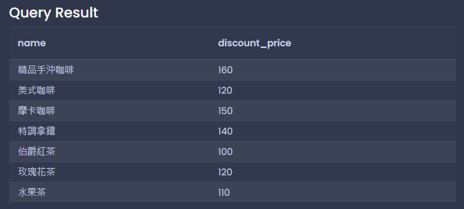

# 每日任務 11/22：「晴天咖啡廳」新人小杰教育訓練奇遇記

[每日任務 11/22 HackMD](https://hackmd.io/uUMshrkYQQmR2O4DfvBeFQ?view)

練習平台：[Temporary Postgres Database](https://pg-sql.com/)

## 目錄

- [模擬資料庫結構](#模擬資料庫結構)

- [基礎查詢篇](#基礎查詢篇)

  - [情境 1：缺貨確認](#情境-1缺貨確認)

  - [情境 2：優惠查詢](#情境-2優惠查詢)

  - [情境 3：價格區間](#情境-3價格區間)

- [AND 條件篇](#and-條件篇)

  - [情境 4：庫存與價格](#情境-4庫存與價格)

  - [情境 5：價格與分類](#情境-5價格與分類)

- [OR 條件篇](#or-條件篇)

  - [情境 6：多分類查詢](#情境-6多分類查詢)

- [BETWEEN 篇](#between-篇)

  - [情境 7：價格區間](#情境-7價格區間)

- [更新資料篇](#更新資料篇)

  - [情境 8：調整價格](#情境-8調整價格)

  - [情境 9：更新庫存](#情境-9更新庫存)

## 模擬資料庫結構

```sql
CREATE TABLE products (
    name VARCHAR(100),         -- 商品名稱
    price INTEGER,            -- 原價
    discount_price INTEGER,    -- 優惠價
    stock INTEGER,            -- 庫存數量
    category VARCHAR(50),      -- 商品分類
    status VARCHAR(20)         -- 商品狀態
);

INSERT INTO products (name, price, discount_price, stock, category, status) VALUES
    ('精品手沖咖啡', 180, 160, 50, '咖啡', 'active'),
    ('美式咖啡', 120, 120, 100, '咖啡', 'active'),
    ('摩卡咖啡', 150, 150, 80, '咖啡', 'active'),
    ('特調拿鐵', 160, 140, 60, '咖啡', 'active'),
    ('伯爵紅茶', 100, 100, 70, '茶飲', 'active'),
    ('玫瑰花茶', 120, 120, 30, '茶飲', 'active'),
    ('柳橙汁', 90, 80, 40, '果汁', 'active'),
    ('水果茶', 130, 110, 45, '茶飲', 'active'),
    ('提拉米蘇', 160, 160, 15, '甜點', 'active'),
    ('草莓乳酪蛋糕', 180, 150, 8, '甜點', 'active'),
    ('巧克力布朗尼', 150, 150, 0, '甜點', 'inactive'),
    ('特選咖啡豆', 500, 450, 20, '咖啡豆', 'active'),
    ('摩卡咖啡豆', 480, 480, 15, '咖啡豆', 'active'),
    ('濾掛式咖啡包', 25, 20, 200, '咖啡', 'active'),
    ('手沖濾紙', 180, 180, 30, '器材', 'active');
```


## 基礎查詢篇

### 情境 1：缺貨確認

顧客：「草莓乳酪蛋糕還有嗎？」

小杰想查：要確認草莓乳酪蛋糕的庫存

```sql
SELECT name, stock
FROM products
WHERE name = '草莓乳酪蛋糕';
```


### 情境 2：優惠查詢

顧客：「有什麼特價的咖啡嗎？」

小杰想查：列出所有有特價（優惠價低於原價）的咖啡類商品

```sql
SELECT name, price, discount_price
FROM products
WHERE category = '咖啡'
  AND price > discount_price
  AND status = 'active';
```


### 情境 3：價格區間

顧客：「有沒有 100 元以下的飲品？」

小杰想查：找出所有 100 元以下的飲品

```sql
SELECT name, discount_price
FROM products
WHERE category IN ('咖啡', '茶飲', '果汁')
  AND discount_price <= 100
  AND status = 'active';
```


## AND 條件篇

### 情境 4：庫存與價格

顧客：「有沒有特價，而且還有貨的甜點？」

小杰想查：要同時符合有特價（優惠價<原價）且還有庫存的甜點

```sql
SELECT name, price, discount_price, stock
FROM products
WHERE category = '甜點'
  AND price > discount_price
  AND stock > 0
  AND status = 'active';
```


### 情境 5：價格與分類

店長：「幫我查一下所有 200 元以上，而且還有庫存的咖啡類商品」

小杰想查：列出符合價格和分類條件的商品

```sql
SELECT name, discount_price, stock
FROM products
WHERE category = '咖啡'
  AND discount_price >= 200
  AND stock > 0
  AND status = 'active';
```


## OR 條件篇

### 情境 6：多分類查詢

顧客：「我想看看你們的咖啡豆和濾掛包」

小杰想查：列出咖啡豆類和濾掛式咖啡的商品

```sql
SELECT * FROM products
WHERE category = '咖啡豆'
  OR name = '濾掛式咖啡包'
  AND status = 'active';
```


## BETWEEN 篇

### 情境 7：價格區間

顧客：「想找 100 到 200 元之間的飲品」

小杰想查：列出這個價格區間的飲品

```sql
SELECT name, discount_price
FROM products
WHERE category IN ('咖啡', '茶飲', '果汁')
  AND discount_price BETWEEN 100 AND 200
  AND status = 'active';
```



## 更新資料篇

### 情境 8：調整價格

店長：「美式咖啡要降價 10 元」

小杰想查：如何更新美式咖啡的優惠價

```sql
UPDATE products
SET discount_price = discount_price - 10
WHERE name = '美式咖啡';
```


### 情境 9：更新庫存

店長：「特選咖啡豆進了 10 包」

小杰想查：如何增加特選咖啡豆的庫存

```sql
UPDATE products
SET stock = stock + 10
WHERE name = '特選咖啡豆';
```


