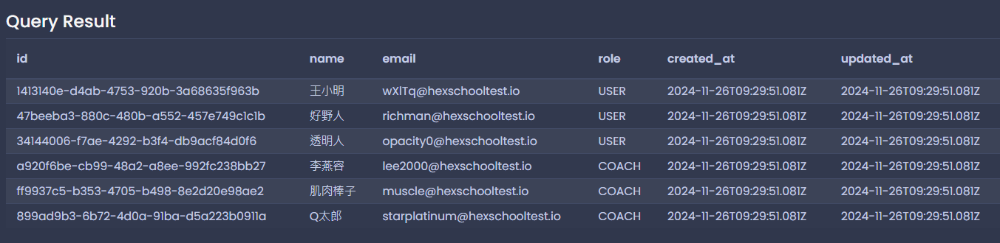
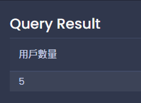

# 每日任務 11/25

[每日任務 11/25 HackMD](https://hackmd.io/XKkdxcKqSyapPEmhP88qgQ?view)

練習平台：[Temporary Postgres Database](https://pg-sql.com/)

## 目錄

- [建立資料庫結構](#建立資料庫結構)

- [第一大題：用戶資料，資料表為 `USER`](#第一大題用戶資料資料表為-user)

  - [1. 新增：新增六筆用戶資料](#1-新增新增六筆用戶資料)

  - [2. 修改](#2-修改)

  - [3. 刪除](#3-刪除)

  - [4. 查詢](#4-查詢)

  - [5. 查詢](#5-查詢)

## 建立資料庫結構

```sql
-- 建立 USER 資料表
CREATE TABLE "USER" (
  id UUID PRIMARY KEY NOT NULL DEFAULT (gen_random_uuid()),
  name VARCHAR(50) NOT NULL,
  email VARCHAR(320) UNIQUE NOT NULL,
  role VARCHAR(20) NOT NULL, -- 角色，分別有 "USER"、"COACH"
  created_at TIMESTAMP NOT NULL DEFAULT (CURRENT_TIMESTAMP),
  updated_at TIMESTAMP NOT NULL DEFAULT (CURRENT_TIMESTAMP)
);
```

### 額外知識補充

- 上方的 `created_at`、`updated_at` 的 `DEFAULT` 是預設值意思，若是在建立資料時沒填寫的話不會報錯，而是會放預設值。

- 上方的建立資料表，會需要用雙引號 `"USER"` 原因是，postgreSQL 的 `user` 是關鍵字，為了避免撞名所以需要加上雙引號。

- 在選取資料表時， 也請留意要加上雙引號，例如 `SELECT * FROM "USER"`。

- `TIMESTAMP` 也是一種資料格式(Data Type)，主要是「時間格式」，範例為 `2024-11-24T17:42:04.452Z`。

## 第一大題：用戶資料，資料表為 `USER`

### 1. 新增：新增六筆用戶資料

資料如下：

- 用戶名稱為 `李燕容`，Email 為 `lee2000@hexschooltest.io`，Role 為 `USER`

- 用戶名稱為 `王小明`，Email 為 `wXlTq@hexschooltest.io`，Role 為 `USER`

- 用戶名稱為 `肌肉棒子`，Email 為 `muscle@hexschooltest.io`，Role 為 `USER`

- 用戶名稱為 `好野人`，Email 為 `richman@hexschooltest.io`，Role 為 `USER`

- 用戶名稱為 `Q太郎`，Email 為 `starplatinum@hexschooltest.io`，Role 為 `USER`

- 用戶名稱為 `透明人`，Email 為 `opacity0@hexschooltest.io`，Role 為 `USER`

```sql
INSERT INTO "USER" (name, email, role)
VALUES
	('李燕容', 'lee2000@hexschooltest.io', 'USER'),
	('王小明', 'wXlTq@hexschooltest.io', 'USER'),
	('肌肉棒子', 'muscle@hexschooltest.io', 'USER'),
	('好野人', 'richman@hexschooltest.io', 'USER'),
	('Q太郎', 'starplatinum@hexschooltest.io', 'USER'),
	('透明人', 'opacity0@hexschooltest.io', 'USER');
```


### 2. 修改

用 Email 找到 `李燕容`、`肌肉棒子`、`Q太郎`，如果他的 Role 為 `USER` 將他的 Role 改為 `COACH`。

```sql
UPDATE "USER"
SET role = 'COACH'
WHERE email IN (
  'lee2000@hexschooltest.io',
  'muscle@hexschooltest.io',
  'starplatinum@hexschooltest.io'
  )
  AND role = 'USER';
```




### 3. 刪除

刪除 `USER` 資料表中，用 Email 找到 `透明人`，並刪除該筆資料。

```sql
DELETE FROM "USER"
WHERE email = 'opacity0@hexschooltest.io';
```


### 4. 查詢

取得 `USER` 資料表目前所有用戶數量（提示：使用`count` 函式）。

```sql
SELECT COUNT(*) AS 用戶數量 FROM "USER";
```



### 5. 查詢

取得 `USER` 資料表所有用戶資料，並列出前 3 筆（提示：使用 `limit` 語法）。

```sql
SELECT * FROM "USER"
LIMIT 3;
```


