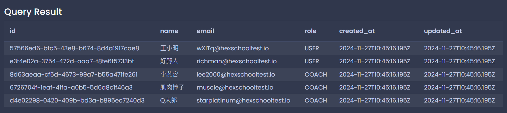
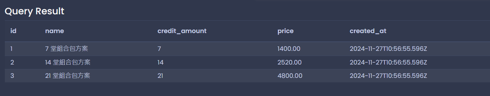
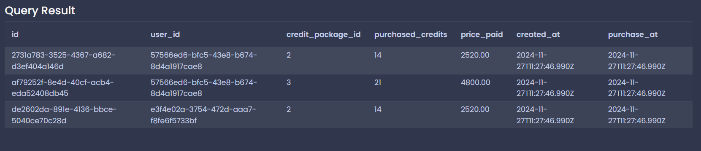

# 每日任務 11/26

[每日任務 11/26 HackMD](https://hackmd.io/gDseaambSbW1pP-H6Yek8g?view)

練習平台：[Temporary Postgres Database](https://pg-sql.com/)

## 目錄

- [建立資料庫](#建立資料庫)

- [第二大題：組合包方案 `CREDIT_PACKAGE`、客戶購買課程堂數 `CREDIT_PURCHASE`](#第二大題組合包方案-credit_package客戶購買課程堂數-credit_purchase)

  - [1. 新增：在 `CREDIT_PACKAGE` 資料表新增三筆資料](#1-新增在-credit_package-資料表新增三筆資料)

  - [2. 新增：在 `CREDIT_PURCHASE` 資料表，新增三筆資料（請使用 `name` 欄位做子查詢）](#2-新增在-credit_purchase-資料表新增三筆資料請使用-name-欄位做子查詢)

## 建立資料庫

```sql
CREATE TABLE "USER" (
  id UUID PRIMARY KEY NOT NULL DEFAULT (gen_random_uuid()),
  name VARCHAR(50) NOT NULL,
  email VARCHAR(320) UNIQUE NOT NULL,
  role VARCHAR(20) NOT NULL, -- 角色，分別有 "USER"、"COACH"
  created_at TIMESTAMP NOT NULL DEFAULT (CURRENT_TIMESTAMP),
  updated_at TIMESTAMP NOT NULL DEFAULT (CURRENT_TIMESTAMP)
);

CREATE TABLE "CREDIT_PACKAGE" (
  id SERIAL PRIMARY KEY,
  name VARCHAR(50) NOT NULL,
  credit_amount INTEGER NOT NULL,
  price NUMERIC(10,2) NOT NULL,
  created_at TIMESTAMP NOT NULL DEFAULT (CURRENT_TIMESTAMP)
);

CREATE TABLE "CREDIT_PURCHASE" (
  id UUID PRIMARY KEY NOT NULL DEFAULT (gen_random_uuid()),
  user_id UUID NOT NULL REFERENCES "USER" (id),
  credit_package_id INTEGER NOT NULL REFERENCES "CREDIT_PACKAGE" (id),
  purchased_credits INTEGER NOT NULL,
  price_paid NUMERIC(10,2) NOT NULL,
  created_at TIMESTAMP NOT NULL DEFAULT (CURRENT_TIMESTAMP),
  purchase_at TIMESTAMP NOT NULL DEFAULT (CURRENT_TIMESTAMP)
);
```

### 欄位介紹

- USER：使用者資料

- CREDIT_PACKAGE：組合包方案

  - credit_amount：堂數

  - price：金額

- CREDIT_PURCHASE：客戶購買課程堂數

  - user_id：使用者 ( USER ) 的 id 資訊

  - purchased_credits：購買堂數

  - price_paid：購買金額

### 題目資料設置

先將 [每日任務 11/25](../task2/task_2.md) 的題目資料加入到資料庫。



## 第二大題：組合包方案 `CREDIT_PACKAGE`、客戶購買課程堂數 `CREDIT_PURCHASE`

### 1. 新增：在 `CREDIT_PACKAGE` 資料表新增三筆資料

資料如下：

- 名稱為 `7 堂組合包方案`，價格為 `1,400` 元，堂數為 `7`。

- 名稱為 `14 堂組合包方案`，價格為 `2,520` 元，堂數為 `14`。

- 名稱為 `21 堂組合包方案`，價格為 `4,800` 元，堂數為 `21`。

```sql
INSERT INTO "CREDIT_PACKAGE" (name, price, credit_amount)
VALUES
	('7 堂組合包方案', 1400, 7),
	('14 堂組合包方案', 2520, 14),
	('21 堂組合包方案', 4800, 21);
```




### 2. 新增：在 `CREDIT_PURCHASE` 資料表，新增三筆資料（請使用 `name` 欄位做子查詢）

資料如下：

- `王小明` 購買 `14 堂組合包方案`。

- `王小明` 購買 `21 堂組合包方案`。

- `好野人` 購買 `14 堂組合包方案`。

透過子查詢取得指定 name 的 user_id：

```sql
SELECT id FROM "USER" WHERE name = '王小明';
SELECT id FROM "USER" WHERE name = '好野人';
```

透過子查詢取得指定 name 的方案資料：

```sql
SELECT id, credit_amount, price FROM "CREDIT_PACKAGE"
WHERE name = '14 堂組合包方案';

SELECT id, credit_amount, price FROM "CREDIT_PACKAGE"
WHERE name = '21 堂組合包方案';
```

組合起來新增資料：

```sql
INSERT INTO "CREDIT_PURCHASE" (user_id, credit_package_id, purchased_credits, price_paid)
VALUES
  (
    -- `王小明` 購買 `14 堂組合包方案`
    (SELECT id FROM "USER" WHERE name = '王小明'),
    (SELECT id FROM "CREDIT_PACKAGE" WHERE name = '14 堂組合包方案'),
    (SELECT credit_amount FROM "CREDIT_PACKAGE" WHERE name = '14 堂組合包方案'),
    (SELECT price FROM "CREDIT_PACKAGE" WHERE name = '14 堂組合包方案')
  ),
  (
   	-- `王小明` 購買 `21 堂組合包方案`
   	(SELECT id FROM "USER" WHERE name = '王小明'),
   	(SELECT id FROM "CREDIT_PACKAGE" WHERE name = '21 堂組合包方案'),
    (SELECT credit_amount FROM "CREDIT_PACKAGE" WHERE name = '21 堂組合包方案'),
    (SELECT price FROM "CREDIT_PACKAGE" WHERE name = '21 堂組合包方案')
  ),
  (
   	-- `好野人` 購買 `14 堂組合包方案`
   	(SELECT id FROM "USER" WHERE name = '好野人'),
   	(SELECT id FROM "CREDIT_PACKAGE" WHERE name = '14 堂組合包方案'),
    (SELECT credit_amount FROM "CREDIT_PACKAGE" WHERE name = '14 堂組合包方案'),
    (SELECT price FROM "CREDIT_PACKAGE" WHERE name = '14 堂組合包方案')
  );
```



