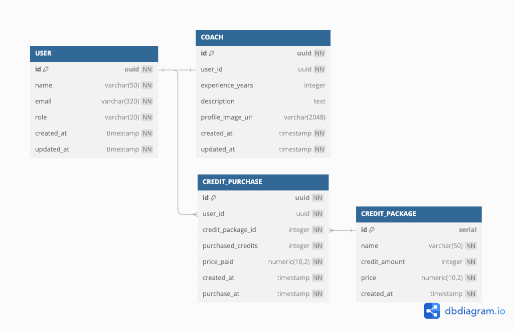
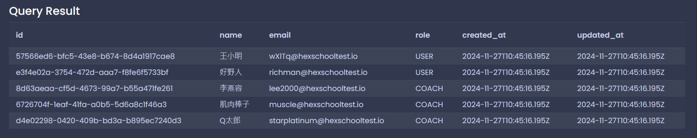
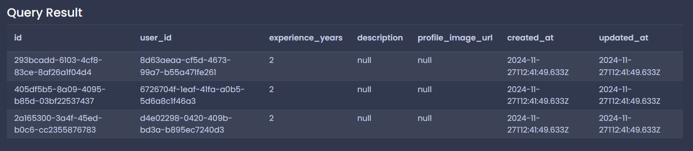
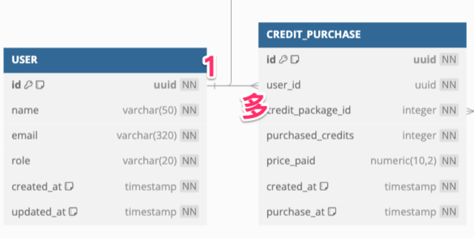
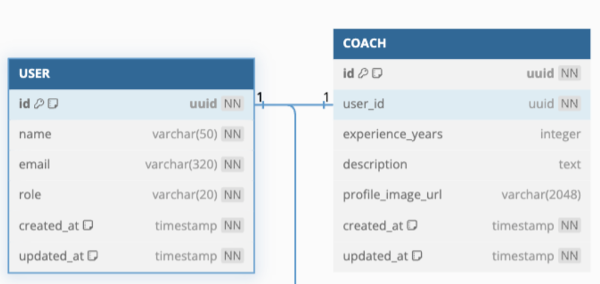
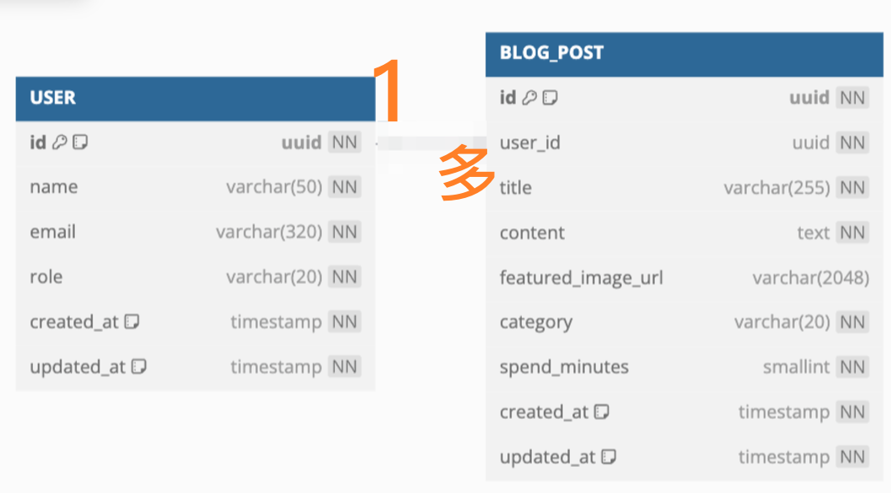

# 每日任務 11/27

[每日任務 11/27 HackMD](https://hackmd.io/bbtQmWqWR2OBXXoW0sSG8g?view)

練習平台：[Temporary Postgres Database](https://pg-sql.com/)

## 目錄

- [建立資料庫](#建立資料庫)

- [題目一：教練資料，資料表為 `COACH`](#題目一教練資料資料表為-coach)

  - [1. 新增：在 `COACH` 資料表新增三筆資料](#1-新增在-coach-資料表新增三筆資料)

- [題目二：何謂一對多、一對一](#題目二何謂一對多一對一)

  - [解釋一對多關係](#解釋一對多關係)

  - [解釋一對一關係](#解釋一對一關係)

- [題目二：使用者與部落格文章的資料表關係](#題目二使用者與部落格文章的資料表關係)

## 建立資料庫

```sql
CREATE TABLE "USER" (
  id UUID PRIMARY KEY NOT NULL DEFAULT (gen_random_uuid()),
  name VARCHAR(50) NOT NULL,
  email VARCHAR(320) UNIQUE NOT NULL,
  role VARCHAR(20) NOT NULL, -- 角色，分別有 "USER"、"COACH"
  created_at TIMESTAMP NOT NULL DEFAULT (CURRENT_TIMESTAMP),
  updated_at TIMESTAMP NOT NULL DEFAULT (CURRENT_TIMESTAMP)
);

CREATE TABLE "COACH" (
  id UUID PRIMARY KEY NOT NULL DEFAULT (gen_random_uuid()),
  user_id UUID NOT NULL REFERENCES "USER" (id),
  experience_years INTEGER,
  description TEXT,
  profile_image_url VARCHAR(2048),
  created_at TIMESTAMP NOT NULL DEFAULT (CURRENT_TIMESTAMP),
  updated_at TIMESTAMP NOT NULL DEFAULT (CURRENT_TIMESTAMP),
  UNIQUE(user_id)
);

CREATE TABLE "CREDIT_PACKAGE" (
  id SERIAL PRIMARY KEY,
  name VARCHAR(50) NOT NULL,
  credit_amount INTEGER NOT NULL,
  price NUMERIC(10,2) NOT NULL,
  created_at TIMESTAMP NOT NULL DEFAULT (CURRENT_TIMESTAMP)
);

CREATE TABLE "CREDIT_PURCHASE" (
  id UUID PRIMARY KEY NOT NULL DEFAULT (gen_random_uuid()),
  user_id UUID NOT NULL REFERENCES "USER" (id),
  credit_package_id INTEGER NOT NULL REFERENCES "CREDIT_PACKAGE" (id),
  purchased_credits INTEGER NOT NULL,
  price_paid NUMERIC(10,2) NOT NULL,
  created_at TIMESTAMP NOT NULL DEFAULT (CURRENT_TIMESTAMP),
  purchase_at TIMESTAMP NOT NULL DEFAULT (CURRENT_TIMESTAMP)
);
```

### 欄位介紹



### 題目資料設置

先將 [每日任務 11/25](../task2/task_2.md) 的題目資料加入到資料庫。



## 題目一：教練資料，資料表為 `COACH`

### 1. 新增：在 `COACH` 資料表新增三筆資料

資料需求如下：

> 提示：使用用戶的 email ，取得用戶的 id。

- 將用戶 `李燕容` 新增為教練，並且年資設定為 `2` 年。

- 將用戶 `肌肉棒子` 新增為教練，並且年資設定為 `2` 年。

- 將用戶 `Q太郎` 新增為教練，並且年資設定為 `2` 年。

可以透過子查詢取得指定 email 的 id：

```sql
INSERT INTO "COACH" (user_id, experience_years)
VALUES
	((SELECT id FROM "USER" WHERE email = 'lee2000@hexschooltest.io'), 2),
	((SELECT id FROM "USER" WHERE email = 'muscle@hexschooltest.io'), 2),
	((SELECT id FROM "USER" WHERE email = 'starplatinum@hexschooltest.io'), 2);
```




## 題目二：何謂一對多、一對一

### 解釋一對多關係

**口訣：「多的要設定外來鍵」**

流程：從欄位角度去規劃

- 以「使用者」角度：一個「使用者」會有 **多筆** 購買紀錄。

- 以「購買紀錄」角度：一筆「購買紀錄」只會屬於 **一個** 使用者。

所以在「**購買紀錄**」表格（多的那方）設定外來鍵 ( `user_id` )。



```sql
-- 一對多（使用者 -> 購買紀錄）
CREATE TABLE "CREDIT_PURCHASE" (
  user_id UUID NOT NULL REFERENCES "USER" (id),  -- 多的那方加外來鍵
);
```

### 解釋一對一關係

**口訣：「外來鍵加唯一值」**

流程：從欄位角度去規劃

- 以「使用者」角度：一個「使用者」最多只能是 **一個** 教練。

- 以「教練」角度：一個「教練」只能對應到 **一個** 使用者。

**在雙方資料表都只能對應一個資訊時，則會是一對一的資料關係。**

所以在「**教練**」表格設定外來鍵，並加上 `UNIQUE` 限制。

```sql
-- 一對一（使用者 <-> 教練）
CREATE TABLE "COACH" (
  user_id UUID NOT NULL REFERENCES "USER" (id)
  -- ...
  UNIQUE(user_id)  -- 外來鍵加唯一值
);
```

`UNIQUE` 意思：表示此 `user_id` 在 `COACH` 資料表上**不能重複**，因為一個「教練」只能對應到 **一個** 使用者。



## 題目二：使用者與部落格文章的資料表關係

請依照以下資料表線索，來分享：

```sql
CREATE TABLE "USER" (
  id UUID PRIMARY KEY NOT NULL DEFAULT (gen_random_uuid()),
  name VARCHAR(50) NOT NULL,
  email VARCHAR(320) UNIQUE NOT NULL,
  role VARCHAR(20) NOT NULL,
  created_at TIMESTAMP NOT NULL DEFAULT (CURRENT_TIMESTAMP),
  updated_at TIMESTAMP NOT NULL DEFAULT (CURRENT_TIMESTAMP)
);

CREATE TABLE "BLOG_POST" (
  id UUID PRIMARY KEY NOT NULL DEFAULT (gen_random_uuid()),
  user_id UUID NOT NULL REFERENCES "USER"(id),
  title VARCHAR(255) NOT NULL,
  content TEXT NOT NULL,
  featured_image_url VARCHAR(2048),
  category VARCHAR(20) NOT NULL,
  spend_minutes SMALLINT NOT NULL,
  created_at TIMESTAMP NOT NULL DEFAULT (CURRENT_TIMESTAMP),
  updated_at TIMESTAMP NOT NULL DEFAULT (CURRENT_TIMESTAMP)
);
```

### 你的分析流程，如下：

流程：從欄位角度去規劃

- 以「使用者」角度：一個「使用者」有 **多個** 「部落格文章」。
- 以「部落格文章」角度：一個「部落格文章」有 **一個** 「使用者」。

所以在「**部落格文章**」表格（多的那方）設定外來鍵 ( `user_id` )。

### 依照上述描述，他是一對一關係、還是一對多？

使用者對部落格文章是**一對多關係**。

```sql
-- 一對多（使用者 -> 部落格文章）
CREATE TABLE "BLOG_POST" (
  -- ...
  user_id UUID NOT NULL REFERENCES "USER"(id), -- 多的那方加外來鍵
  -- ...
);
```


