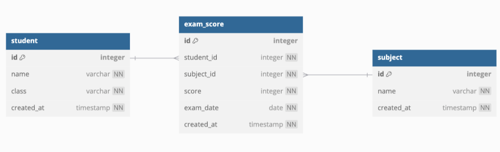
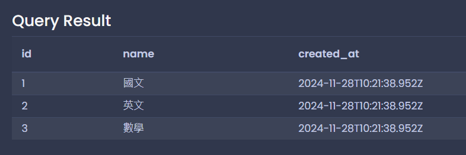
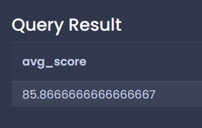
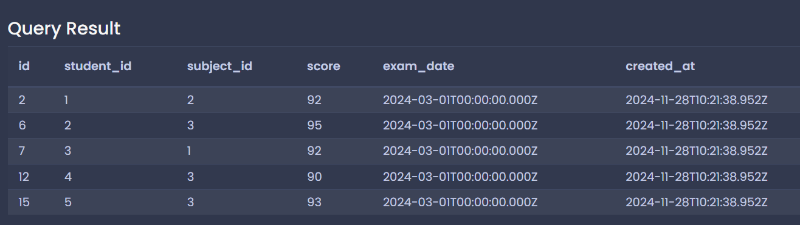
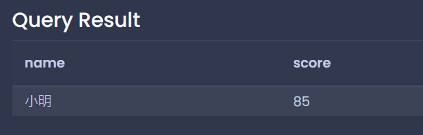

# 每日任務 11/28：學生國文、數學、英文成績

[每日任務 11/28 HackMD](https://hackmd.io/T26dfv2FQOCW2w4JKvdXSw)

練習平台：[Temporary Postgres Database](https://pg-sql.com/)

## 目錄

- [建立資料庫](#建立資料庫)

- [題目一：查看所有科目](#題目一查看所有科目)

- [題目二：計算所有成績平均](#題目二計算所有成績平均)

- [題目三：找出 90 分以上的成績](#題目三找出-90-分以上的成績)

- [題目四：會使用到 INNER JOIN](#題目四會使用到-inner-join)

## 建立資料庫

### 欄位介紹



### 資料表與模擬資料

- subject ：科目名稱

- exam_score：科目成績

- student：學生資料

```sql
-- 建立資料表
CREATE TABLE student (
 id SERIAL PRIMARY KEY,
 name VARCHAR(50) NOT NULL,
 class VARCHAR(20) NOT NULL,
 created_at TIMESTAMP NOT NULL DEFAULT (CURRENT_TIMESTAMP)
);

CREATE TABLE subject (
 id SERIAL PRIMARY KEY,
 name VARCHAR(50) NOT NULL,
 created_at TIMESTAMP NOT NULL DEFAULT (CURRENT_TIMESTAMP)
);

CREATE TABLE exam_score (
 id SERIAL PRIMARY KEY,
 student_id INTEGER NOT NULL,
 subject_id INTEGER NOT NULL,
 score INTEGER NOT NULL,
 exam_date DATE NOT NULL,
 created_at TIMESTAMP NOT NULL DEFAULT (CURRENT_TIMESTAMP),
 FOREIGN KEY (student_id) REFERENCES student (id),
 FOREIGN KEY (subject_id) REFERENCES subject (id)
);

-- 插入測試資料
INSERT INTO student (name, class)
VALUES
  ('小明', '三年一班'),
  ('小華', '三年一班'),
  ('小美', '三年一班'),
  ('小龍', '三年一班'),
  ('小智', '三年一班');

INSERT INTO subject (name)
VALUES
  ('國文'),
  ('英文'),
  ('數學');

INSERT INTO exam_score (student_id, subject_id, score, exam_date)
VALUES
  (1, 1, 85, '2024-03-01'),
  (1, 2, 92, '2024-03-01'),
  (1, 3, 78, '2024-03-01'),
  (2, 1, 76, '2024-03-01'),
  (2, 2, 88, '2024-03-01'),
  (2, 3, 95, '2024-03-01'),
  (3, 1, 92, '2024-03-01'),
  (3, 2, 85, '2024-03-01'),
  (3, 3, 87, '2024-03-01'),
  (4, 1, 78, '2024-03-01'),
  (4, 2, 82, '2024-03-01'),
  (4, 3, 90, '2024-03-01'),
  (5, 1, 88, '2024-03-01'),
  (5, 2, 79, '2024-03-01'),
  (5, 3, 93, '2024-03-01');
```

## 題目一：查看所有科目

```sql
SELECT * FROM subject;
```



## 題目二：計算所有成績平均

```sql
SELECT
	AVG(score) AS avg_score
FROM exam_score;
```



## 題目三：找出 90 分以上的成績

```sql
SELECT * FROM exam_score
WHERE score >= 90;
```



## 題目四：會使用到 INNER JOIN

顯示小明的國文成績，篩選條件請用國文的 `subject_id = 1` 進行篩選。

```sql
SELECT
	student.name,
  exam_score.score
FROM exam_score
INNER JOIN student ON exam_score.student_id = student.id
WHERE student.name = '小明' AND exam_score.subject_id = 1;
```


