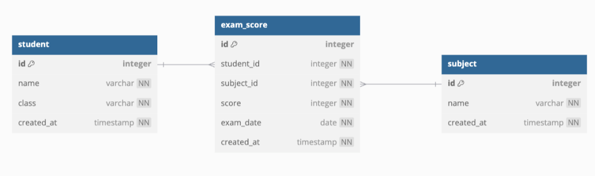
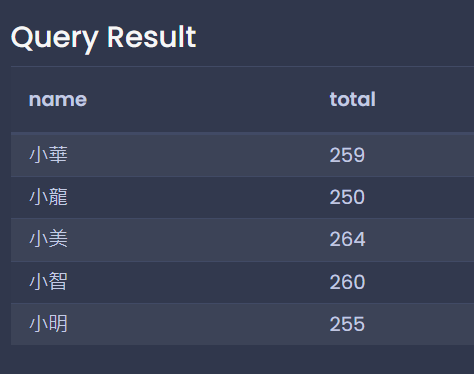
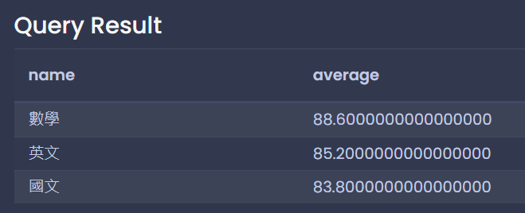
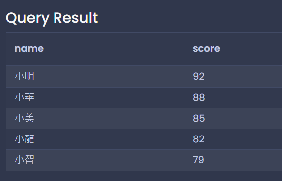
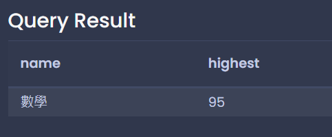
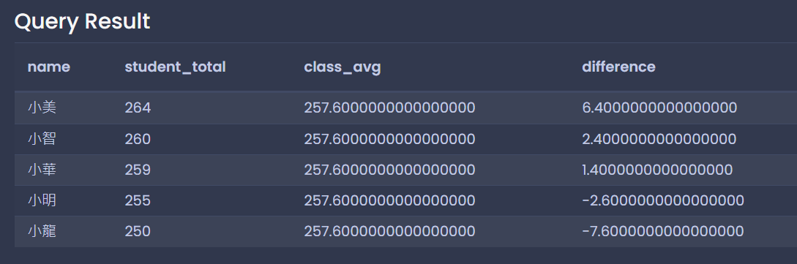

# 每日任務 11/29：學生國文、數學、英文成績

[每日任務 11/29 HackMD](https://hackmd.io/UM9RRA0jQ1myscdTq2iObg?view)

練習平台：[Temporary Postgres Database](https://pg-sql.com/)

## 目錄

- [建立資料庫](#建立資料庫)

- [題目一：計算每個學生的總分](#題目一計算每個學生的總分)

- [題目二：計算每科的平均分數並依分數排序](#題目二計算每科的平均分數並依分數排序)

- [題目三：顯示英文成績排名](#題目三顯示英文成績排名)

- [題目四：找出考最好的科目](#題目四找出考最好的科目)

- [題目五(稍難)：計算每位學生的總分和全班平均的差距，依總分排序](#題目五稍難計算每位學生的總分和全班平均的差距依總分排序)

## 建立資料庫

### 欄位介紹



### 資料表與模擬資料

- subject ：科目名稱

- exam_score：科目成績

- student：學生資料

```sql
-- 建立資料表
CREATE TABLE student (
 id SERIAL PRIMARY KEY,
 name VARCHAR(50) NOT NULL,
 class VARCHAR(20) NOT NULL,
 created_at TIMESTAMP NOT NULL DEFAULT (CURRENT_TIMESTAMP)
);

CREATE TABLE subject (
 id SERIAL PRIMARY KEY,
 name VARCHAR(50) NOT NULL,
 created_at TIMESTAMP NOT NULL DEFAULT (CURRENT_TIMESTAMP)
);

CREATE TABLE exam_score (
 id SERIAL PRIMARY KEY,
 student_id INTEGER NOT NULL,
 subject_id INTEGER NOT NULL,
 score INTEGER NOT NULL,
 exam_date DATE NOT NULL,
 created_at TIMESTAMP NOT NULL DEFAULT (CURRENT_TIMESTAMP),
 FOREIGN KEY (student_id) REFERENCES student (id),
 FOREIGN KEY (subject_id) REFERENCES subject (id)
);

-- 插入測試資料
INSERT INTO student (name, class)
VALUES
  ('小明', '三年一班'),
  ('小華', '三年一班'),
  ('小美', '三年一班'),
  ('小龍', '三年一班'),
  ('小智', '三年一班');

INSERT INTO subject (name)
VALUES
  ('國文'),
  ('英文'),
  ('數學');

INSERT INTO exam_score (student_id, subject_id, score, exam_date)
VALUES
  (1, 1, 85, '2024-03-01'),
  (1, 2, 92, '2024-03-01'),
  (1, 3, 78, '2024-03-01'),
  (2, 1, 76, '2024-03-01'),
  (2, 2, 88, '2024-03-01'),
  (2, 3, 95, '2024-03-01'),
  (3, 1, 92, '2024-03-01'),
  (3, 2, 85, '2024-03-01'),
  (3, 3, 87, '2024-03-01'),
  (4, 1, 78, '2024-03-01'),
  (4, 2, 82, '2024-03-01'),
  (4, 3, 90, '2024-03-01'),
  (5, 1, 88, '2024-03-01'),
  (5, 2, 79, '2024-03-01'),
  (5, 3, 93, '2024-03-01');
```

## 題目一：計算每個學生的總分

```sql
SELECT
	student.name AS name,
	SUM(exam_score.score) AS total
FROM student
INNER JOIN exam_score ON student.id = exam_score.student_id
GROUP BY student.name;
```



## 題目二：計算每科的平均分數並依分數排序

```sql
SELECT
	subject.name AS name,
	AVG(exam_score.score) AS average
FROM subject
INNER JOIN exam_score ON subject.id = exam_score.subject_id
GROUP BY subject.name
ORDER BY average DESC;
```



## 題目三：顯示英文成績排名

```sql
SELECT
	student.name AS name,
	exam_score.score AS score
FROM student
INNER JOIN exam_score ON student.id = exam_score.student_id
WHERE exam_score.subject_id = (SELECT id FROM subject WHERE name = '英文')
ORDER BY score DESC;
```



## 題目四：找出考最好的科目

```sql
SELECT
	subject.name AS name,
	MAX(exam_score.score) AS highest
FROM subject
INNER JOIN exam_score ON subject.id = exam_score.subject_id
GROUP BY subject.name
ORDER BY highest DESC
LIMIT 1;
```



## 題目五(稍難)：計算每位學生的總分和全班平均的差距，依總分排序

```sql
SELECT
  student.name AS name,
  SUM(exam_score.score) AS student_total,
  (
    SELECT AVG(total)
    FROM (SELECT SUM(score) AS total FROM exam_score GROUP BY student_id) AS student_total
  ) AS class_avg,
  SUM(exam_score.score) -
  (
    SELECT AVG(total)
    FROM (SELECT SUM(score) AS total FROM exam_score GROUP BY student_id) AS student_total
  ) AS difference
FROM student
INNER JOIN exam_score ON student.id = exam_score.student_id
GROUP BY student.name
ORDER BY student_total DESC;
```


